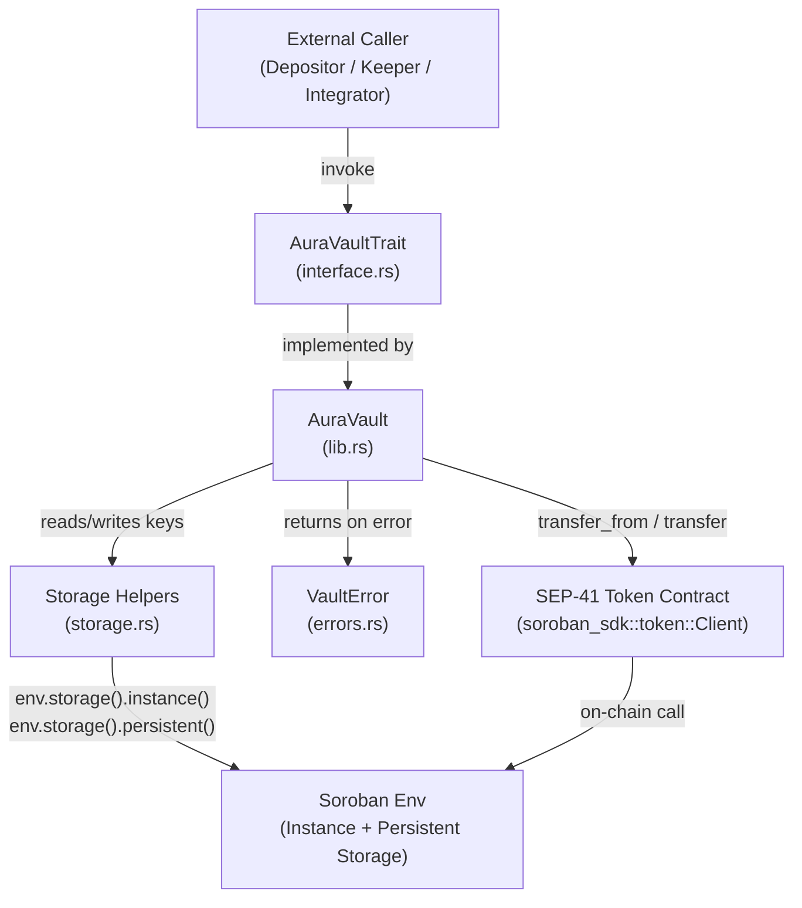
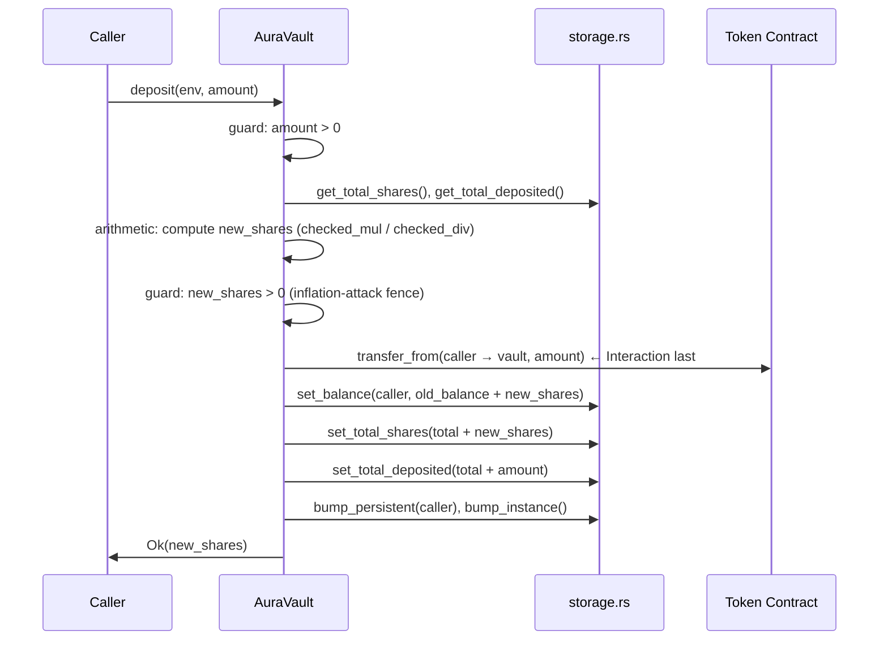
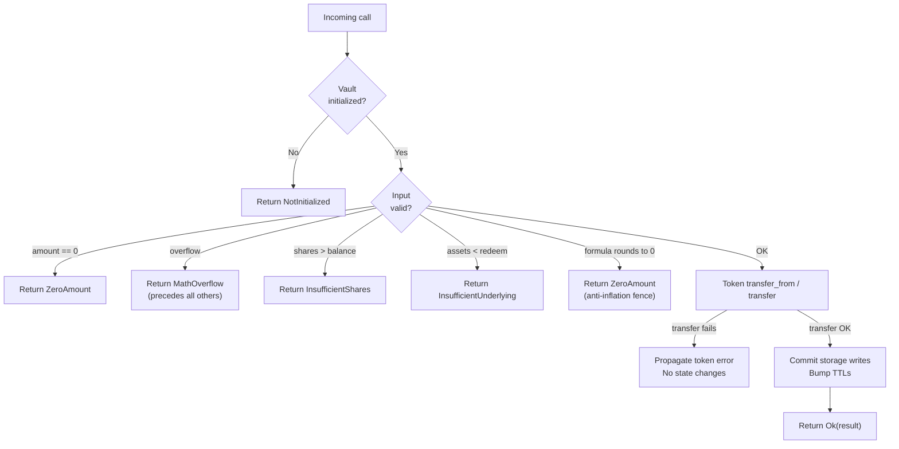

# Design Document: Aura Yield Vault

## Overview

Aura is a share-based yield vault smart contract on Soroban (Stellar's WebAssembly smart contract platform). It holds a single SEP-41-compatible underlying token, issues proportional vault shares to depositors, and compounds yield through keeper-triggered harvests. All share accounting follows the ERC-4626 share-pricing model adapted to Soroban's `no_std`, `i128`-based arithmetic environment.

The contract is a single deployable Wasm binary with no upgrade proxy. Privileged operations are gated on an admin address stored at initialization. The design prioritizes:
- **Mathematical correctness** — all share arithmetic uses checked operations; no silent overflow
- **State consistency** — Checks-Effects-Interactions (CEI) ordering on all mutating calls
- **Liveness** — TTL extension on every mutating call prevents state archival mid-operation
- **Minimal trust surface** — no admin key required for deposits, withdrawals, or reads; keeper role is permissionless

---

## Architecture

### Module Boundaries

```
aura-vault/
└── src/
    ├── lib.rs         Entry point: #![no_std], mod declarations, AuraVault #[contract] impl
    ├── errors.rs      VaultError #[contracterror] enum
    ├── storage.rs     DataKey #[contracttype] enum, TTL constants, storage helper functions
    ├── interface.rs   AuraVaultTrait #[contractspecentry] trait definition
    └── test.rs        #[cfg(test)] full test suite (unit + property-based)
```

Each module has a single responsibility:

| Module | Responsibility |
|---|---|
| `lib.rs` | Orchestrates the full call lifecycle: auth checks → arithmetic → CEI writes → TTL bumps |
| `errors.rs` | Defines the typed error surface; no logic |
| `storage.rs` | Owns all key definitions, TTL constants, and the three storage helper pairs (get/set for each domain) |
| `interface.rs` | The public ABI contract; implementation is in `lib.rs` |
| `test.rs` | All tests; gated with `#[cfg(test)]`; may use `std` and `proptest` |

### Component Interaction Diagram



### Call Lifecycle (deposit as canonical example)



> **CEI Ordering**: All Checks and Effects computations are performed before the token `transfer_from` call. Once the external call succeeds, storage writes are committed. This mirrors the CEI pattern and prevents re-entrancy exploitation through the token callback path.

---

## Components and Interfaces

### `AuraVaultTrait` (interface.rs)

```rust
#[contractspecentry]
pub trait AuraVaultTrait {
    /// One-time initialization. Returns VaultError::AlreadyInitialized on re-call.
    fn initialize(env: Env, admin: Address, underlying_token: Address) -> Result<(), VaultError>;

    /// Deposit `amount` underlying tokens; returns shares minted.
    fn deposit(env: Env, amount: i128) -> Result<i128, VaultError>;

    /// Burn `shares` and receive proportional underlying tokens; returns redeemed amount.
    fn withdraw(env: Env, shares: i128) -> Result<i128, VaultError>;

    /// Inject `yield_amount` underlying tokens without minting shares.
    fn harvest(env: Env, yield_amount: i128) -> Result<(), VaultError>;

    /// Read-only: returns current TotalDeposited.
    fn total_assets(env: Env) -> i128;

    /// Read-only: returns share balance for `address`.
    fn balance_of(env: Env, address: Address) -> i128;
}
```

### `VaultError` (errors.rs)

```rust
#[contracterror]
#[derive(Copy, Clone, Debug, Eq, PartialEq)]
#[repr(u32)]
pub enum VaultError {
    NotInitialized      = 1,
    AlreadyInitialized  = 2,
    InsufficientShares  = 3,
    InsufficientUnderlying = 4,
    ZeroAmount          = 5,
    MathOverflow        = 6,
    InvalidAddress      = 7,
    ZeroShares          = 8,
}
```

Error precedence rule: `MathOverflow` (6) takes precedence over any concurrently applicable error. All fallible operations return a `Result<_, VaultError>`; no `unwrap()` or `expect()` outside `#[cfg(test)]`.

### `DataKey` and Storage Helpers (storage.rs)

```rust
#[contracttype]
pub enum DataKey {
    Admin,
    UnderlyingToken,
    TotalShares,
    TotalDeposited,
    Balance(Address),   // per-user persistent entry
}
```

Helper function pairs (all in `storage.rs`):

| Helper | Storage type | Operation |
|---|---|---|
| `get_admin / set_admin` | Instance | Read/write `DataKey::Admin` |
| `get_token / set_token` | Instance | Read/write `DataKey::UnderlyingToken` |
| `get_total_shares / set_total_shares` | Instance | Read/write `DataKey::TotalShares` |
| `get_total_deposited / set_total_deposited` | Instance | Read/write `DataKey::TotalDeposited` |
| `get_balance / set_balance` | Persistent | Read/write `DataKey::Balance(addr)` |
| `bump_instance` | Instance | Extend TTL to `INSTANCE_BUMP_AMOUNT` |
| `bump_persistent` | Persistent | Extend TTL to `PERSISTENT_BUMP_AMOUNT` for a given key |

`get_balance` returns `0_i128` when the key is absent (no panic on missing entry).

---

## Data Models

### Storage Layout

| Key | Storage Bucket | Type | Semantics |
|---|---|---|---|
| `DataKey::Admin` | Instance | `Address` | Contract admin; set once at init |
| `DataKey::UnderlyingToken` | Instance | `Address` | SEP-41 token contract address |
| `DataKey::TotalShares` | Instance | `i128` | Sum of all outstanding shares |
| `DataKey::TotalDeposited` | Instance | `i128` | Running total of underlying units custodied (increases on deposit + harvest, decreases on withdraw) |
| `DataKey::Balance(addr)` | Persistent | `i128` | Per-user share balance |

**Why `i128`?** Soroban's token standard (`soroban_sdk::token`) uses `i128` for all amounts. Using the same type eliminates any cast-related overflow risk and aligns with SEP-41 conventions.

**Why Instance vs. Persistent split?** Instance storage is cheaper for frequently-read global state (read on every call) and has a single TTL entry to manage. Per-user balances use Persistent storage because they have independent lifetimes and must survive even if no one interacts with the vault for extended periods.

### Key Encoding

All `DataKey` variants are `#[contracttype]`-annotated, so Soroban's XDR codec handles serialization automatically. `DataKey::Balance(address_a)` and `DataKey::Balance(address_b)` produce distinct XDR encodings when `address_a != address_b` — no custom hashing or collision risk.

### Type Constraints

- All stored values use only `soroban_sdk`-provided types (`Address`, `i128`)
- No `std::string::String`, `Vec`, `Box`, or OS interfaces
- `core` primitives (`i128::checked_mul`, etc.) are used for arithmetic

---

## Share Accounting Algorithm

### Core Formulas

**Minting shares on deposit:**
```
if total_shares == 0:
    new_shares = amount                                   // 1:1 seeding
else:
    new_shares = floor(amount * total_shares / total_assets)
```

**Redeeming underlying on withdrawal:**
```
redeem_amount = floor(shares * total_assets / total_shares)
```

**Exchange rate (informational, not stored):**
```
exchange_rate = total_assets / total_shares     // (only defined when total_shares > 0)
```

**Harvest (no shares minted):**
```
total_deposited += yield_amount
// exchange_rate strictly increases
```

### Worked Examples

**Example 1 — Initial deposit (1:1 seeding)**
```
State before:  total_shares = 0,  total_deposited = 0
Deposit:       amount = 1_000_000
New shares:    1_000_000  (1:1 because total_shares == 0)
State after:   total_shares = 1_000_000,  total_deposited = 1_000_000
Exchange rate: 1.000000
```

**Example 2 — Second deposit after yield accrual**
```
State before:  total_shares = 1_000_000,  total_deposited = 1_200_000  (after harvest)
Deposit:       amount = 600_000
New shares:    floor(600_000 * 1_000_000 / 1_200_000) = floor(500_000) = 500_000
State after:   total_shares = 1_500_000,  total_deposited = 1_800_000
Exchange rate: 1.200000 (unchanged — new depositor pays the appreciated price)
```

**Example 3 — Withdrawal**
```
State:         total_shares = 1_500_000,  total_deposited = 1_800_000
Withdraw:      shares = 500_000
Redeem:        floor(500_000 * 1_800_000 / 1_500_000) = floor(600_000) = 600_000
State after:   total_shares = 1_000_000,  total_deposited = 1_200_000
Exchange rate: 1.200000 (unchanged — withdrawal preserves rate for remaining holders)
```

**Example 4 — Harvest non-dilution**
```
State before:  total_shares = 1_000_000,  total_deposited = 1_000_000
Harvest:       yield_amount = 50_000
State after:   total_shares = 1_000_000,  total_deposited = 1_050_000
Exchange rate before: 1.000000
Exchange rate after:  1.050000  (strictly greater — no dilution)
```

**Example 5 — Round-trip rounding loss (worst case)**
```
State:         total_shares = 3,  total_deposited = 10
Deposit:       amount = 1
New shares:    floor(1 * 3 / 10) = floor(0.3) = 0  → VaultError::ZeroAmount returned
(deposit rejected; no rounding loss because no shares were minted)
```

```
State:         total_shares = 10,  total_deposited = 10
Deposit:       amount = 7
New shares:    floor(7 * 10 / 10) = 7
Withdraw:      floor(7 * 10 / 10) = 7  (recovered exactly)
Net rounding loss: 0
```

```
State:         total_shares = 10,  total_deposited = 13
Deposit:       amount = 7
New shares:    floor(7 * 10 / 13) = floor(5.38) = 5
Withdraw:      floor(5 * 13 / 10) = floor(6.5) = 6
Net rounding loss: 1 unit  (acceptable: bounded by 1 per round-trip)
```

### Overflow Safety

Every multiplication step uses `checked_mul`, every division uses `checked_div`. The pattern for the deposit formula is:

```rust
let numerator = amount.checked_mul(total_shares)
    .ok_or(VaultError::MathOverflow)?;
let new_shares = numerator.checked_div(total_assets)
    .ok_or(VaultError::MathOverflow)?;
```

`MathOverflow` is returned before any storage write, satisfying the "overflow check first" precedence rule.

Additionally, `Cargo.toml` sets `overflow-checks = true` in the release profile as a defense-in-depth measure, ensuring that any arithmetic path not explicitly using `checked_*` still traps rather than wrapping silently.

---

## TTL / Archival Strategy

### Ledger Math

Soroban ledgers close approximately every 5 seconds. The named constants are:

```rust
// 17,280 ledgers ≈ 1 day  (5s × 17,280 = 86,400s)
pub const DAY_IN_LEDGERS: u32 = 17_280;

pub const INSTANCE_LIFETIME_THRESHOLD: u32 = DAY_IN_LEDGERS * 7;   //  7 days
pub const INSTANCE_BUMP_AMOUNT: u32        = DAY_IN_LEDGERS * 30;   // 30 days

pub const PERSISTENT_LIFETIME_THRESHOLD: u32 = DAY_IN_LEDGERS * 7;  //  7 days
pub const PERSISTENT_BUMP_AMOUNT: u32        = DAY_IN_LEDGERS * 30;  // 30 days
```

`BUMP_AMOUNT > LIFETIME_THRESHOLD` is enforced by the values (30 > 7). In practice the bump is called unconditionally on every mutating call, not threshold-guarded, to eliminate any race condition between a TTL check and the bump itself.

### Bump Call Points

| Function | Instance bump | Persistent bump |
|---|---|---|
| `initialize` | ✓ | — |
| `deposit` | ✓ | ✓ caller's `Balance` key |
| `withdraw` | ✓ | ✓ caller's `Balance` key |
| `harvest` | ✓ | — |

The bump calls happen at the **end** of each function, after all storage writes, so they cannot be skipped if any write succeeds. Read-only functions (`total_assets`, `balance_of`) do not bump; bumping reads is unnecessary and wastes gas.

### Archival Recovery

If a user's `Balance` entry is archived (TTL expired, entry went cold), the Soroban network requires a dedicated restore transaction before the entry can be accessed. The contract itself does not need to handle this case — the Soroban host will return a `ContractError` during the access attempt. Integrators and keepers should monitor entry TTLs and issue restore operations proactively.

---

## Error Handling

### Error Return Flow



### Error Precedence

When multiple error conditions apply simultaneously:
1. `MathOverflow` — always checked first, before any storage reads needed for other guards
2. `ZeroAmount` — checked on raw input before formula evaluation
3. All other errors — evaluated in the order they appear in the call logic

This ordering ensures that callers always receive the most actionable error first.

### No-Panic Contract

The production code path (everything outside `#[cfg(test)]`) must not call `unwrap()`, `expect()`, `panic!()`, or `todo!()`. All fallible operations use `?` propagation through `Result<_, VaultError>`. The `#[contracterror]` macro ensures that `VaultError` variants serialize correctly as Soroban error codes across the host–guest boundary.

---

## Security Considerations

### Re-entrancy in Soroban

Soroban's execution model is synchronous and single-threaded within a transaction. A re-entrant call from a token callback back into AuraVault within the same transaction would require the token contract to call `deposit`, `withdraw`, or `harvest` on the vault before the original call returns. This is theoretically possible via a malicious token contract.

**Mitigation:** The vault follows strict CEI ordering. All arithmetic and guard checks are complete before any external token call. All storage writes happen after the token call returns successfully. This means a re-entrant call would see the pre-write state (not intermediate state), and the final write would overwrite any state the re-entrant path modified — effectively treating the re-entrant call as operating on stale data. Vault invariants are maintained.

### Inflation Attack

The classic inflation attack on vault-style contracts works as follows:
1. Attacker becomes the first depositor with a tiny amount, receiving 1 share
2. Attacker donates a large amount directly to the vault (bypassing `deposit`), inflating `total_assets` without minting shares
3. A victim depositor gets 0 shares due to rounding (their `amount * 1 / large_total_assets = 0`), then the attacker withdraws everything

**Mitigations in Aura:**
- **1:1 seeding** (Requirement 2.2): The first depositor always receives `amount` shares at 1:1. There is no initial share price the attacker can manipulate.
- **Zero-share mint rejection** (Requirements 2.13, 6.5): If the share minting formula produces 0, the deposit is rejected with `VaultError::ZeroAmount` and the caller's tokens are never transferred. The attacker cannot cause a victim to lose tokens without receiving shares.
- **Harvest-only yield injection** (Requirement 4): The only way to increase `TotalDeposited` is via `harvest`, which requires a token transfer from the caller. Direct token transfers to the vault address are not tracked by the contract and do not affect `TotalDeposited`. Therefore, donation-based inflation is not possible — `TotalDeposited` is always equal to the sum of deposited + harvested amounts.

> Note: This design uses **accounting-based** `TotalDeposited` tracking rather than reading the vault's live token balance via `token::Client::balance(vault_address)`. This is intentional. Reading live balance would allow external token transfers to manipulate the exchange rate. By maintaining an internal counter, the vault is immune to direct-transfer inflation attacks.

### Checked Arithmetic

All multiplication and division use `checked_mul` / `checked_div`. Combined with `overflow-checks = true` in the release profile, there are two layers of overflow protection. The `MathOverflow` error is returned before any state mutation, satisfying the atomicity requirement.

### Admin Key Management

The admin address is set once at initialization and cannot be changed. Admin-exclusive operations (if any are added in future) must be explicitly gated with `admin.require_auth()`. The current v1 design has no admin-only runtime operations — the admin field is reserved for future governance use.

---

## Testing Strategy

### Dual Testing Approach

The test suite uses both example-based and property-based testing:

- **Example-based unit tests** verify specific scenarios, error paths, and edge cases
- **Property-based tests** verify universal invariants across randomized inputs

### Property-Based Testing Library

The test suite uses [`proptest`](https://github.com/proptest-rs/proptest) with the `no_std` feature disabled (tests run on the host with `std`, not inside Wasm). Proptest is configured via `dev-dependencies` in `Cargo.toml`:

```toml
[dev-dependencies]
proptest = "1"
soroban-sdk = { version = "22", features = ["testutils"] }
```

Each property test runs a **minimum of 100 iterations** (proptest default: 256). Tests are tagged with a comment referencing the design property they validate:
```rust
// Feature: aura-yield-vault, Property N: <property text>
```

### Test Environment Setup

All tests use `mock_all_auths()` and create a `StellarAssetClient` for the underlying token:

```rust
fn setup() -> (Env, AuraVaultClient, Address, Address) {
    let env = Env::default();
    env.mock_all_auths();
    let admin = Address::generate(&env);
    let token_address = env.register_stellar_asset_contract(admin.clone());
    let vault_address = env.register_contract(None, AuraVault);
    let vault = AuraVaultClient::new(&env, &vault_address);
    vault.initialize(&admin, &token_address);
    (env, vault, admin, token_address)
}
```

### Unit Test Coverage Checklist

| Scenario | Error expected |
|---|---|
| Double initialization | `AlreadyInitialized` |
| deposit before init | `NotInitialized` |
| deposit(0) | `ZeroAmount` |
| withdraw(0) | `ZeroAmount` |
| harvest(0) | `ZeroAmount` |
| withdraw > balance | `InsufficientShares` |
| harvest on empty vault | `ZeroShares` |
| balance_of for new address | returns `0` |
| total_assets on fresh vault | returns `0` |
| two equal depositors each hold half | proportionality |

---

## Correctness Properties

*A property is a characteristic or behavior that should hold true across all valid executions of a system — essentially, a formal statement about what the system should do. Properties serve as the bridge between human-readable specifications and machine-verifiable correctness guarantees.*

### Property 1: Share-Sum Invariant

*For any* sequence of `deposit` and `withdraw` calls by any number of distinct addresses, after each call completes, the sum of all individual `Balance(addr)` values recorded in Persistent_Storage SHALL equal `TotalShares` in Instance_Storage.

**Validates: Requirements 6.1, 10.3**

---

### Property 2: Deposit-Withdraw Round-Trip Rounding Invariant

*For any* vault state where `Total_Shares > 0` and `Total_Assets > 0`, and *for any* `amount` in `[1, i128::MAX / 2]`, if `deposit(amount)` succeeds and mints `new_shares > 0`, then immediately calling `withdraw(new_shares)` SHALL return at least `amount - 1` underlying token units to the caller.

**Validates: Requirements 6.3, 10.1**

---

### Property 3: Harvest Non-Dilution

*For any* vault state where `Total_Shares > 0`, and *for any* `yield_amount` in `[1, i128::MAX / 2 - TotalDeposited]`, calling `harvest(yield_amount)` SHALL:
1. Leave `Total_Shares` unchanged
2. Leave all individual `Balance(addr)` values unchanged
3. Strictly increase `TotalDeposited / Total_Shares` (the exchange rate)

**Validates: Requirements 4.3, 4.4, 10.2**

---

### Property 4: First-Deposit 1:1 Seeding

*For any* `amount` in `[1, i128::MAX / 2]` deposited into a vault with `Total_Shares == 0`, the vault SHALL mint exactly `amount` shares to the caller, and `Total_Shares` SHALL equal `amount` after the call.

**Validates: Requirements 2.2, 6.5**

---

### Property 5: Share Minting Formula Correctness

*For any* vault state where `Total_Shares > 0` and `Total_Assets > 0`, and *for any* `amount` in `[1, i128::MAX / Total_Shares]` such that `floor(amount * Total_Shares / Total_Assets) > 0`, calling `deposit(amount)` SHALL mint exactly `floor(amount * Total_Shares / Total_Assets)` shares and increase `TotalDeposited` by exactly `amount`.

**Validates: Requirements 2.3, 2.4**

---

### Property 6: Overflow Guard

*For any* vault state where `Total_Shares > 0`, calling `deposit` or `withdraw` with an `amount` or `shares` value that would cause `checked_mul` to return `None` during share formula computation SHALL return `VaultError::MathOverflow` and leave all vault state variables unchanged.

**Validates: Requirements 2.8, 3.7, 8.3, 10.4**

---

### Property 7: Zero-Share Mint Rejection (Inflation-Attack Fence)

*For any* vault state where `Total_Shares > 0` and `Total_Assets > 0`, and *for any* `amount` such that `floor(amount * Total_Shares / Total_Assets) == 0`, calling `deposit(amount)` SHALL return `VaultError::ZeroAmount` and leave `TotalDeposited`, `Total_Shares`, and the caller's balance unchanged.

**Validates: Requirements 2.13, 6.5**

---

### Property 8: Withdrawal User Isolation

*For any* vault state with two or more distinct depositors, calling `withdraw(shares)` by address A SHALL leave the `Balance(B)` Persistent_Storage entry of every other address B unchanged.

**Validates: Requirements 6.6**

---

### Property 9: Harvest Exchange Rate Strict Increase

*For any* vault state where `Total_Shares > 0` and `TotalDeposited > 0`, calling `harvest(yield_amount)` with `yield_amount >= 1` SHALL produce `new_rate > old_rate` where `rate = TotalDeposited * PRECISION / Total_Shares` (integer exchange rate scaled by a precision factor to avoid flooring to the same value).

*Note: This property is a strengthened restatement of Property 3 item 3, expressed with explicit precision scaling to make it testable at the unit level. It is not redundant because it specifies the verification mechanism.*

**Validates: Requirements 4.4**

---

### Property 10: Serialization Round-Trip

*For any* `DataKey` variant and *for any* value written to that key within a Soroban test environment, reading back the value using the same `DataKey` in a subsequent invocation SHALL produce the byte-for-byte identical value as was written.

*Specifically:* `DataKey::Balance(address_a)` and `DataKey::Balance(address_b)` SHALL write to and read from distinct storage slots when `address_a != address_b`.

**Validates: Requirements 11.3, 11.4**

---

## Deployment and Upgrade Considerations

### Initial Deployment

1. Build for `wasm32-unknown-unknown` with `overflow-checks = true`:
   ```
   cargo build --target wasm32-unknown-unknown --release
   ```
2. Upload the Wasm binary to the Stellar network (`stellar contract upload`)
3. Deploy the contract instance (`stellar contract deploy`)
4. Call `initialize(admin, underlying_token)` in the same or a subsequent transaction

There is no constructor in Soroban — the `initialize` function acts as the guarded constructor. It must be called exactly once; subsequent calls return `AlreadyInitialized`.

### Upgrade Path

The current design is **non-upgradeable**. There is no `set_code` or proxy pattern. If a bug is found:
1. Deploy a new contract instance
2. Notify users to migrate by withdrawing from the old vault and depositing into the new one
3. Optionally, the admin can be given a `migrate` function in a future version that calls `token::transfer` to move custodied funds — but this would require re-initialization semantics and is out of scope for v1

This approach favors simplicity and auditability over upgradeability. For a DeFi primitive that holds user funds, immutability is a security property.

### Wasm Code TTL

The deployed Wasm binary itself has an independent TTL on the Stellar network. It must be periodically extended via `stellar contract extend` or the Soroban host's `extend_contract_code_ttl` operation. This is an operational responsibility outside the contract code itself. Keepers or the admin should monitor the Wasm TTL alongside the instance storage TTL.

### Gas and Resource Limits

Each Soroban transaction is subject to CPU instruction limits and memory limits. Key gas considerations for Aura:
- `deposit` and `withdraw` involve one cross-contract call to the token contract — the most expensive operation
- `harvest` also involves one token cross-contract call
- TTL bump calls (`bump_instance`, `bump_persistent`) are cheap ledger entry updates
- `total_assets` and `balance_of` are read-only and have minimal resource consumption

No unbounded loops or dynamic-size collections exist in the contract, so instruction counts are bounded and predictable.
